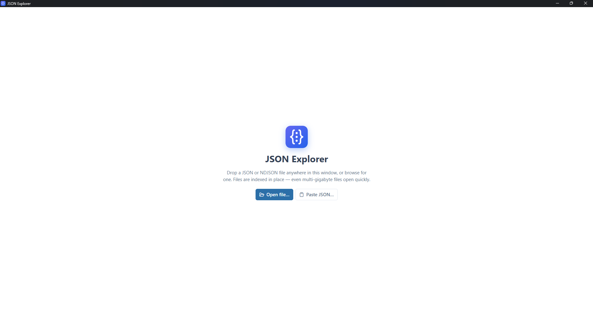
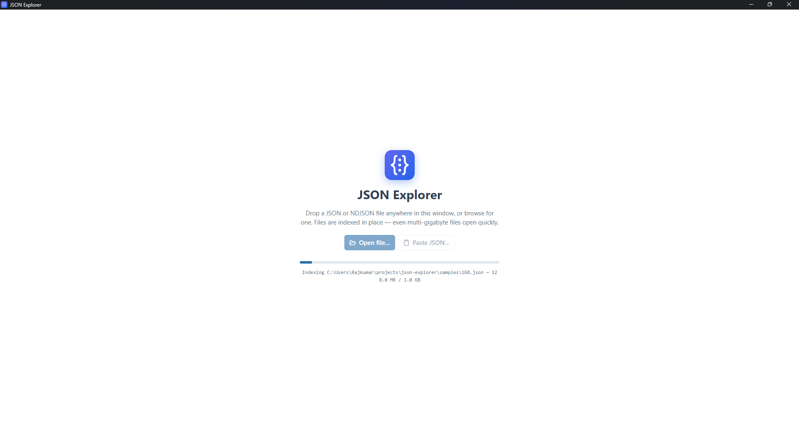
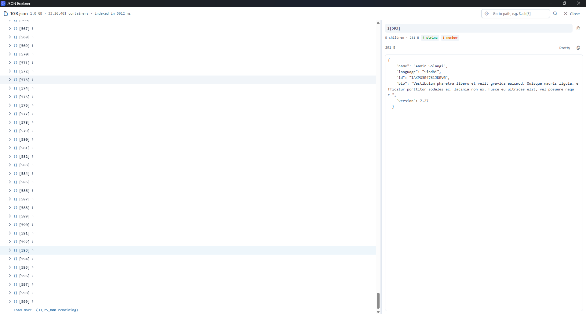
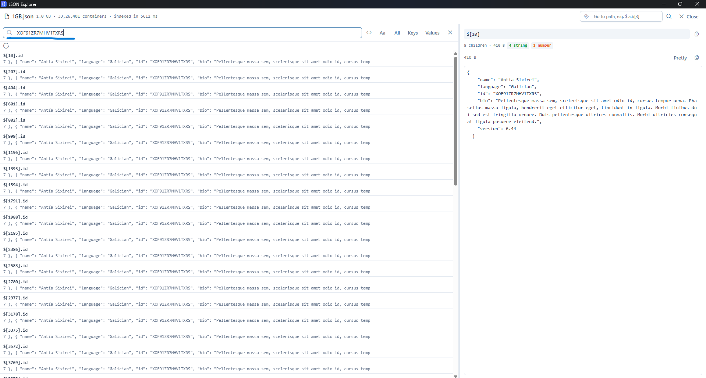
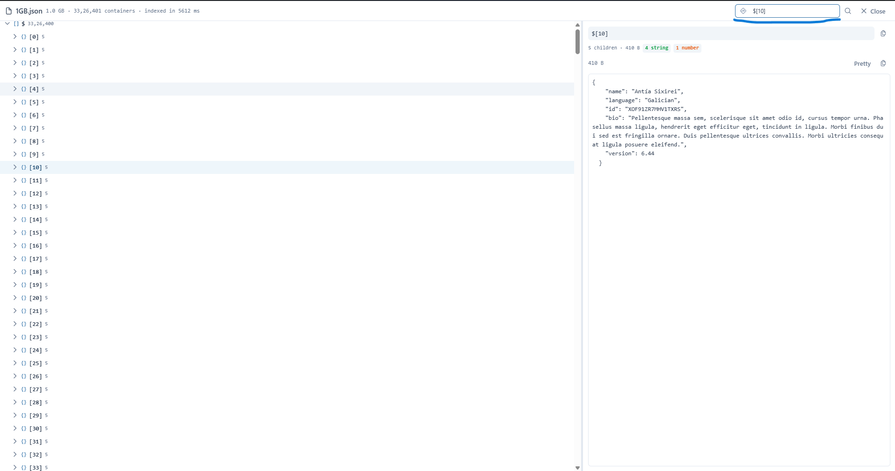

# JSON Explorer

Desktop app for opening and exploring large JSON files. Built with Tauri 2, Vue 3, TypeScript and PrimeVue.

## Features

- Opens JSON and NDJSON by drag-and-drop, file browse, or paste — files are indexed in place, so multi-gigabyte files open fast
- Virtualized tree view with incremental "load more" — millions of containers without choking
- Search across keys and/or values, case-sensitive and regex modes, with hit navigation
- Go-to-path jump (`$.a.b[3]`)
- Inspector pane with pretty-printed values, byte size, child count and type breakdown
- Keyboard navigation and copy menu on tree rows

## Installation

Download the build for your OS from the **[latest release](https://github.com/rajkumarGosavi/json-explorer/releases/latest)**: Windows `.msi`, macOS `.dmg` (Apple Silicon and Intel), or Linux `.AppImage`/`.deb`.

JSON Explorer isn't OS-code-signed yet, so the first launch shows an "unknown publisher" warning (a reputation prompt, not a virus detection):

- **Windows:** on the **"Windows protected your PC"** dialog click **More info → Run anyway**.
- **macOS:** right-click the app → **Open** → **Open**. If it says "damaged", run once: `xattr -dr com.apple.quarantine "/Applications/JSON Explorer.app"`.
- **Linux (.AppImage):** `chmod +x JSON\ Explorer_*.AppImage`, then run.

## Screenshots

### Open screen

Drop a file anywhere, browse for one, or paste JSON directly.



### Indexing

Progress while a 1 GB file is indexed in place.



### Tree view

Virtualized tree next to the inspector pane — 33M+ containers indexed in ~5.6 s.



### Value search

Search values across the whole file, with matching paths and previews.



### Go to path

Jump straight to a node by its JSON path.



## Requirements

- Node.js 18+ and pnpm
- Rust toolchain (for the Tauri desktop build)

## Development

```bash
pnpm install
pnpm dev          # web dev server
pnpm tauri dev    # desktop app
```

## Build

```bash
pnpm build        # type-check + web bundle
pnpm tauri build  # desktop binaries
```

## Test

```bash
pnpm test         # vitest run
pnpm test:watch
```

## Layout

```
src/          Vue app (components, views, stores, composables, utils)
src-tauri/    Rust backend
samples/      sample JSON files
scripts/      helper scripts
```

## Recommended IDE Setup

[VS Code](https://code.visualstudio.com/) + [Vue - Official](https://marketplace.visualstudio.com/items?itemName=Vue.volar) + [Tauri](https://marketplace.visualstudio.com/items?itemName=tauri-apps.tauri-vscode) + [rust-analyzer](https://marketplace.visualstudio.com/items?itemName=rust-lang.rust-analyzer)

## License

MIT — see [LICENSE](LICENSE).
